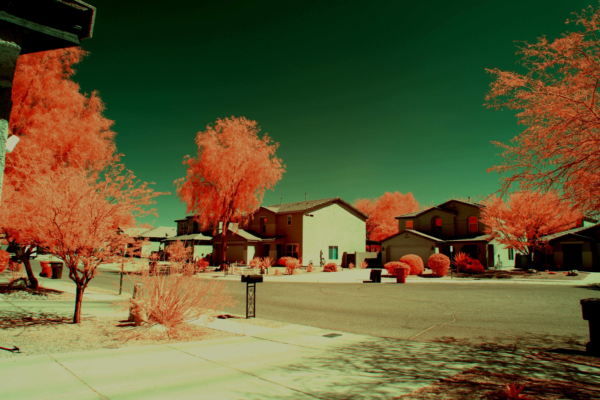
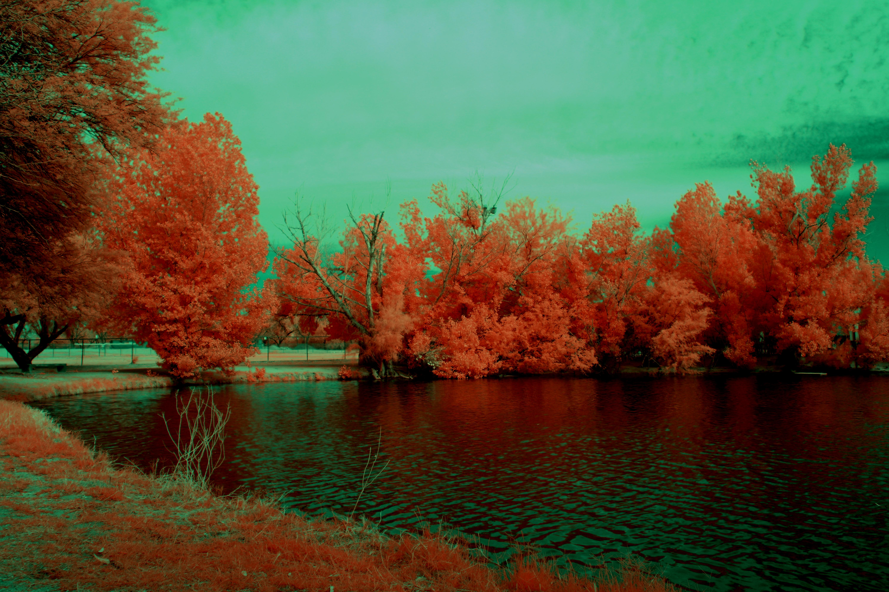

# Aerochromizer
Converts photos taken through a "Full Spectrum" modified camera into [Kodak Aerochrome](https://www.analog.cafe/r/kodak-aerochrome-a-colour-ir-film-guide-and-review-uwi3) styled photos. 

## To Install
This has been tested with Python 3.13. You'll want to install the requirements in requirements.txt before attempting to
run the script. 

## To Use
Simply run the script:
````
python aerochromizer.py --image [path to input jpeg] --output [path to output jpeg]
````

If you find the default values for some of the adjustments not to your liking, feel free to experiment. These can be 
changed at runtime easily. For a full list of variables at any time, run with the -h parameter:

````
  -h, --help            show this help message and exit
  --image IMAGE         File path of input image [REQUIRED]
  --output OUTPUT       File path of output image [REQUIRED]
  --wb1 WB1             Initial White Balance Temperature (1000 to 10000K) [default 5000]
  --wb2 WB2             Second White Balance Temperature (1000 to 10000K) [default 4500]
  --contrast CONTRAST   Contrast Adjustment Scale [default 1.8]
  --saturation SATURATION
                        Saturation Adjustment Scale [default 1.8]
  --brightness BRIGHTNESS
                        Brightness Adjustment Scale [default 0.75]
  --red RED             Red Adjustment Scale [default 1.0]
  --green GREEN         Green Adjustment Scale [default 0.5]
  --blue BLUE           Blue Adjustment Scale [default 1.0]
````

## Operation
1. Assume photo is taken white balanced to something approximately white (such as concrete). Use of Red25A filter assumed
2. White balance is changed to 'wb1' (in Kelvin) via table found [here](https://stackoverflow.com/questions/11884544/setting-color-temperature-for-a-given-image-like-in-photoshop)
3. Colors are adjusted according to scales in inputs 'red', 'green', 'blue'
4. Color channel swapped -- RGB to BRR
5. White balance is yet again changed, this time to 'wb2' (in Kelvin)
6. Contrast, Color, Brightness scales are modified per inputs 'contrast', 'saturation', 'brigtness'
7. File is saved to disk to path specified in 'output'

## Samples
Samples are listed non-modified first, converted second. Taken with a full-spectrum Canon EOS M100 through Red25A filter 
### Sample 1



### Sample 2


